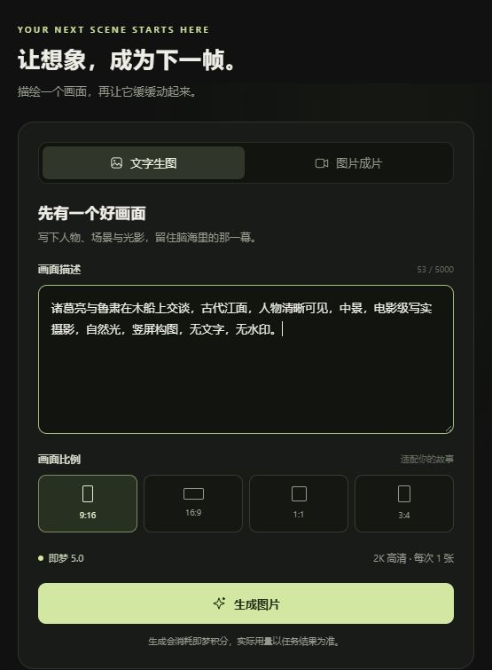
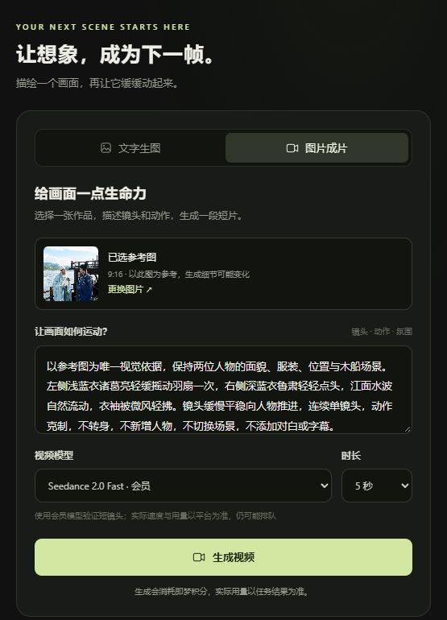
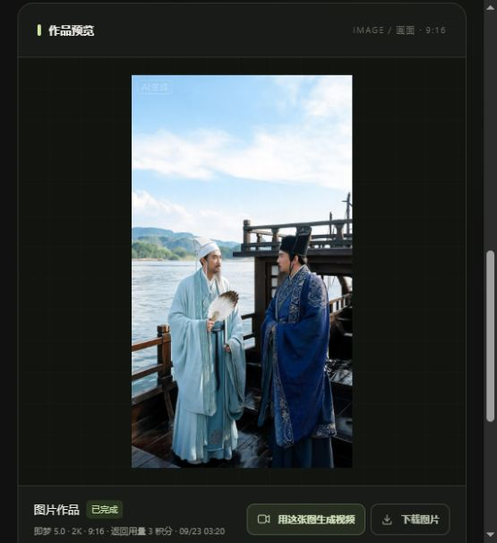

# 小说影坊 · novel-storyboard

把一个画面描述，变成一张图片，再让它成为一段短片。

[使用指南](IMAGE_GUIDE.md) · [全部文档](docs/README.md) · [开发路线图](docs/ROADMAP.md) · [参与开发](CONTRIBUTING.md)

## 最新界面

以下为 **2026-09-23 本机实际运行截图**，不是界面设计稿。示例为诸葛亮与鲁肃船上交谈；截图仅展示工作区，未展示账户信息。

<p>
  
  
</p>

<details>
<summary>展开查看实际图片结果与更多示例</summary>



图片与视频需要人工检查人物、服装、历史细节和动作合理性。更多结构化分镜示例见 [示例说明](docs/EXAMPLES.md)，截图维护记录见 [预览图片说明](docs/images/README.md)。

</details>

## 现在能做什么

推荐的 **7861 即梦工作台** 已打通：

```text
输入画面描述 → 生成一张 2K 图片 → 选图并描述动作 → 5/10 秒视频 → 预览、下载原始 MP4
```

- 不用在自己的显卡上运行大型媒体模型；通过已登录的 Dreamina CLI 调用云端生成。
- 图片/视频作品库、真实任务状态、重复提交保护，以及重启后恢复已有任务查询。
- 每类最多一个进行中任务；提交结果不明时不会自动重试付费生成。
- 素材保存在本机；有 FFmpeg 时自动制作兼容播放的 WebM 副本，下载仍保留原始 MP4。

**当前是单镜头创作闭环，不是长章节一键生成完整短剧。** 云端仍可能排队，生成会消耗即梦积分；会员不代表每个模型都可用。参考图也不能保证跨镜头同脸。自动配音、字幕和云端多镜头剪辑尚未串联。

## 开始使用

### 已部署的电脑

1. 双击根目录 **Start-Film.cmd**，打开 [本机工作台](http://127.0.0.1:7861/)。`Start-Images.cmd` 是兼容入口。
2. 在「文字生图」输入画面描述，选择比例并生成图片。
3. 选中满意的图片，点击「用这张图生成视频」，填写动作与镜头运动，先制作 5 秒试片。
4. 完成后预览并下载。需要持续查询、下载时，电脑和后台服务必须保持运行。

详细操作、积分、恢复查询与播放说明见 [即梦影像工作台指南](IMAGE_GUIDE.md)。

### 新下载仓库 / 换电脑

仓库不是包含所有依赖的安装包：不附带 Python 环境、Dreamina CLI、模型或登录凭据。

云端工作台需要 Windows、Python 环境位于 `.local/venv/`（建议 3.12）、官方 Dreamina CLI 位于 `.tools/dreamina.exe`，以及你自己的已授权账号。FFmpeg 可选，用于兼容预览；**不需要 ComfyUI 或本地视频模型**。初始化步骤见 [新电脑准备](IMAGE_GUIDE.md#新电脑准备)。

本工具只面向本机使用，不要通过端口转发直接暴露到公网。

## 另外两条路径

- **本地模型实验（7860）**：`Start-Studio.cmd`，正文规划、分镜审核、Wan / AnimateDiff 镜头生成与 MP4 合成。需另装模型，画质和速度受硬件影响，当前成片没有配音。见 [本地指南](LOCAL_GUIDE.md)。
- **Agent 分镜工作流**：把有权使用的文本交给 `novel-director`，产出来源说明、剧情摘要、人物场景设定、分镜和生成提示词。保留两组完整示例。见 [运行手册](RUNBOOK.md)。

这三条路径不是同一条已完成的全自动流水线。长文本规划与云端逐镜生成的衔接属于后续方向。

## 已记录的短片实测

2026-09-23，诸葛亮与鲁肃船上交谈，Seedance 2.0 Fast 会员模型，720×1280 竖屏、约 5 秒：从提交到 MP4 下载完成约 **3 分 33 秒**，平台返回 **30 积分**。这是一次样片记录，不是速度、价格或质量承诺；生成图片另计。

## 仓库怎么找文件

- `app/`：页面、后端和离线测试。
- `scripts/`：启动、查询、校验和实验脚本，见 [脚本索引](scripts/README.md)。
- `docs/`：文档索引、真实界面截图、示例与路线图。
- `source/`、`output/`：可公开的示例原文与分镜交付包。
- `rights/`：原文来源与改编权利说明。
- `.local/`、`.tools/`、`media-tasks/`：本机环境、工具和任务素材，均不上传。

私人正文放 `source/private/`，私人改编包放 `output/private/`，这两个目录默认忽略。其他位置的文本不会自动保密。完整规则见 [目录与文件规范](docs/PROJECT_STRUCTURE.md)。

## 检查与开发

在仓库根目录运行（Python 3.12、Node.js 24）：

```powershell
python -m unittest discover -s app -p test_image_server.py -v
node app/test_images_ui.cjs
python scripts/check-repo.py
```

测试拦截生成平台请求，不花积分、不下载模型。前端使用 DOM 模拟，不能替代真实浏览器播放和布局验收。GitHub Actions 配置相同的离线检查，详见 [贡献指南](CONTRIBUTING.md)。

下一步重点是逐镜关联分镜与素材、预算控制、云端多镜头合成，再逐步接入声音字幕；详见 [路线图](docs/ROADMAP.md)。

## 许可与内容边界

代码遵循 [MIT License](LICENSE)，保留原有作者署名。模型、平台和素材遵循各自许可或条款；代码开源不等于获得小说改编授权。

只处理用户主动提供且有权使用的文本，不抓取小说网站。示例来源与用途见 [权利说明](rights/PROJECT_RIGHTS.md)。请勿在 Issue、截图或提交中公开账号凭据、未授权正文及私人生成素材。
