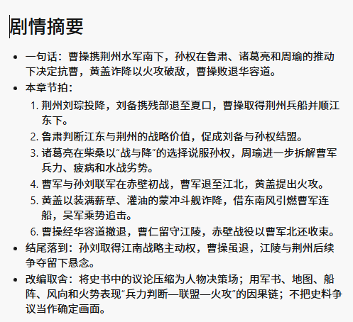
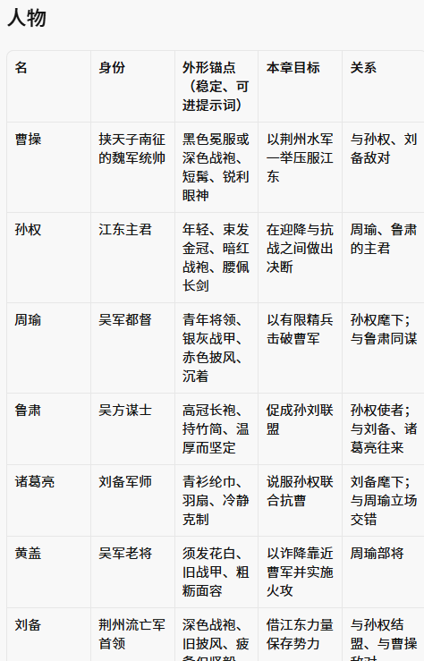
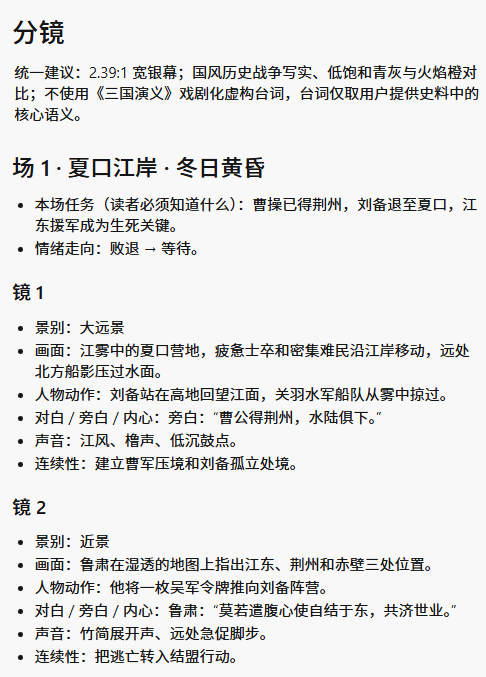
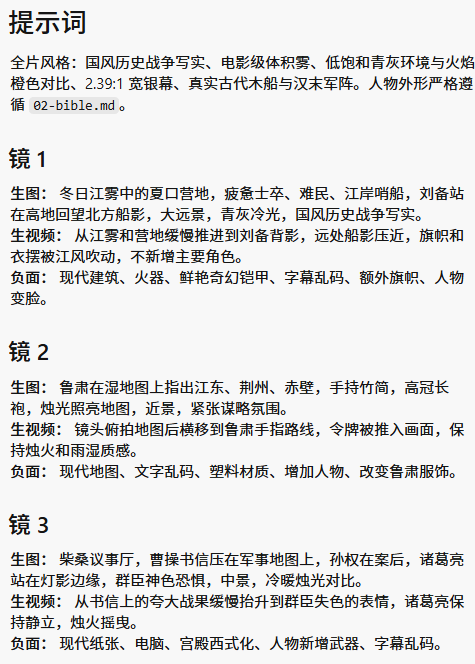
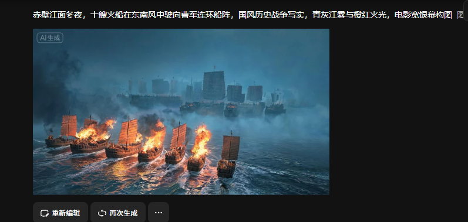
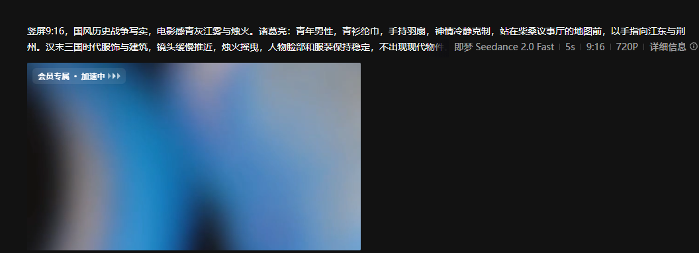

# 小说分镜 Agent

把你有权使用的小说章节，改编成剧情总结、分镜指导和生图/生视频提示词。

这不是独立网站，也不是爬虫。打开本文件夹，在 Cursor 里把任务交给 **novel-director**。模型用你的 Cursor 订阅，产出写在 `output/`。

## 为什么做

小说视频化不是一次提示词生成，而是包含剧情理解、人物与场景约束、镜头拆解和生成任务衔接的连续流程。直接把长文本交给生视频模型，容易出现情节遗漏、镜头不可执行和人物设定漂移。本项目把这套流程拆成可检查、可复用的中间产物。

## 产品流程

```text
有权使用的正文
-> 剧情摘要
-> 人物 / 场景 / 时间线设定
-> 分场分镜
-> 生图 / 生视频提示词
-> Dreamina 生成任务（可选）
```

## 效果预览

工作流先输出可人工审核的结构化文档，而不是直接进入高成本媒体生成。

### 剧情摘要与人物设定





### 分镜与生成提示词





### 媒体生成链路

以下截图用于证明提示词已经进入实际生图和视频任务；生成结果仍需要人工检查历史细节、角色一致性和镜头质量。





## 关键设计决策

- **结构化中间产物：** 每一步单独保存，便于人工审核后再进入下一阶段。
- **一致性约束：** 先建立人物、场景和时间线设定，再生成具体镜头提示词。
- **完整性校验：** 提供脚本检查必需文件和输出结构，避免缺步骤交付。
- **成本控制：** 示例不会自动提交付费生成任务；只有明确调用流水线时才进入媒体生成。
- **版权边界：** 仅处理用户提供且有权改编的文本，不抓取小说网站。

仓库当前包含 2 组完整示例输出，共 10 份结构化交付文件，可用于检查流程和输出格式。

## 怎么用

1. 把章节 `.txt` / `.md` 放进 `source/`（或直接把正文贴进对话）
2. 在对话里输入：`/novel-director` 或「用 novel-director 把 source 里的章节做成分镜」
3. 到 `output/<书名或章节名>/` 看四份稿：

| 文件 | 内容 |
|------|------|
| `01-summary.md` | 剧情摘要 |
| `02-bible.md` | 人物、场景、时间线 |
| `03-storyboard.md` | 分场分镜（景别、动作、对白、情绪） |
| `04-prompts.md` | 可复制给生图 / 生视频模型的提示词 |

首次使用可以直接参考 `source/example-chapter.md` 和
`output/example-chapter/`。示例文本是项目自带的虚构内容，不代表真实作品。

完成改编后，可运行校验脚本检查输出是否齐全：

```powershell
.\scripts\validate-output.ps1 -Path .\output\<书名或章节名>
```

更完整的运行约定见 `RUNBOOK.md`。

项目也预留了 Dreamina CLI 适配脚本，可在账号具备 CLI 权限后生成图片和视频；先阅读 `RUNBOOK.md` 中的“Dreamina CLI”部分。生成任务会消耗额度，示例不会自动提交付费任务。

## 边界（v1）

- **做：** 解析你提供的文本 → 总结 → 分镜 → 提示词
- **不做：** 爬番茄小说或任何网站；不调用外部生图/生视频 API（等你有 Key 再加）
- **素材：** 只处理你自己提供、且有权改编的文本

## 项目结构

```
source/                 你放入的原文
output/                 Agent 写出的改编包
rights/                 本项目用途说明
.cursor/agents/         novel-director 自定义 Agent
.cursor/skills/         分镜工作流（Agent 会读）
```

有了生图/生视频 Key 之后，在同一套目录上加第五步，不必另起一个 App。

长章节的自动生成入口是 `scripts/run-dreamina-pipeline.ps1`：它读取已有的 `04-prompts.md`，按镜头顺序串行调用 Dreamina，并把结果下载到 `media-tasks/`，不会创建额外的排队网页。

## 后续改进方向

当前版本重点完成“小说文本 → 分镜稿 → Dreamina 视频片段”的工作流。后续计划逐步完善为完整的 AI 短剧生产流水线：

1. **完整视频合成**
   - 接入 FFmpeg
   - 自动拼接镜头片段
   - 统一画幅、分辨率、帧率和片段时长
   - 输出最终 MP4

2. **声音和字幕**
   - 接入文本转语音服务
   - 为不同人物配置稳定音色
   - 自动生成对白、旁白和字幕
   - 增加背景音乐和战场音效

3. **长文本自动化**
   - 自动按章节和完整场景切分
   - 支持断点续跑和失败重试
   - 记录每个章节的处理状态
   - 支持批量生成多章内容

4. **人物与场景一致性**
   - 建立跨章节人物设定库
   - 保存角色参考图和外观锚点
   - 固定服装、年龄、发型和画面风格
   - 检查前后镜头的连续性

5. **生成任务管理**
   - 保存每个镜头的提示词、任务编号和生成结果
   - 增加本地任务清单和重试机制
   - 控制并发数量，避免超过 Dreamina 限制
   - 记录额度消耗和失败原因

6. **使用方式优化**
   - 支持直接粘贴长章节后自动写入 `source/`
   - 提供统一命令行入口
   - 增加示例配置和环境检查
   - 逐步支持在 GitHub Actions 或服务器上运行

7. **安全与版权**
   - 继续只处理用户提供且有权改编的文本
   - API Key 和本地登录状态不进入 GitHub
   - 生成媒体和大型临时文件保持本地或使用对象存储

## 可量化指标

后续实际运行时建议记录：

- 每章字数、拆分场景数和镜头数；
- 从输入正文到生成完整分镜包的耗时；
- 一次校验通过率与人工补改次数；
- 人物、服装和场景设定在跨镜头检查中的一致率；
- Dreamina 任务成功率、平均重试次数、单镜头耗时与额度消耗；
- 与纯人工拆分镜相比节省的时间（通过同一章节对照测量）。
